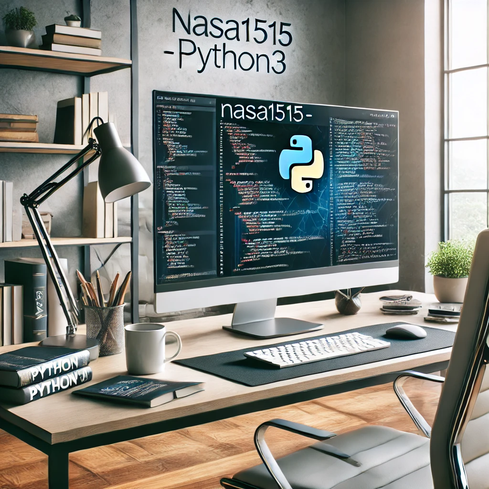

# Python Algorithm Storage of NASA1515

경험하고 학습한 Python과 관련된 내용을 정리하고, Python으로 구현하는 Algorithm 문제를 정리한 대피소입니다.    
* 기초 베이스부터 다지기 위해서 쌩 Base를 기반으로 작성하는 대피소 입니다.
* 단순히 답만 띡 던져놓는 방식이 아닌, 각 문제 별 MD로 풀이를 정리합니다.

### 시작일 : 2024.07.05 
----

## 🟫 [BRONZE LEVEL] LIST

  
[구현]

   

* [1157. 단어 공부 [BRONZE - 1]](https://github.com/nasa1515/Learn_Algorithm-Python/blob/main/Baekjoon%20Online%20Judge/Bronze/materialize(%EA%B5%AC%ED%98%84)/Q.1157%20%EB%8B%A8%EC%96%B4%20%EA%B3%B5%EB%B6%80%20%5BBRONZE%20-%201%5D.md)
* [1546. 평균 [BRONZE - 1]](https://github.com/nasa1515/Learn_Algorithm-Python/blob/main/Baekjoon%20Online%20Judge/Bronze/materialize(%EA%B5%AC%ED%98%84)/Q.1546%20%ED%8F%89%EA%B7%A0%20%5BBRONZE%20-%201%5D.md)  
* [2566. 최댓값 [BRONZE - 3]](https://github.com/nasa1515/Learn_Algorithm-Python/blob/main/Baekjoon%20Online%20Judge/Bronze/materialize(%EA%B5%AC%ED%98%84)/Q.2566%20%EC%B5%9C%EB%8C%93%EA%B0%92%20%5BBRONZE%20-%203%5D%20copy.md)  
* [2738. 행렬 덧셈 [BRONZE - 3]](https://github.com/nasa1515/Learn_Algorithm-Python/blob/main/Baekjoon%20Online%20Judge/Bronze/materialize(%EA%B5%AC%ED%98%84)/Q.2738%20%ED%96%89%EB%A0%AC%20%EB%8D%A7%EC%85%88%20%5BBRONZE%20-%203%5D.md)   
* [3052. 나머지 [BRONZE - 3]](https://github.com/nasa1515/Learn_Algorithm-Python/blob/main/Baekjoon%20Online%20Judge/Bronze/materialize(%EA%B5%AC%ED%98%84)/Q.3052%20%EB%82%98%EB%A8%B8%EC%A7%80%20%5BBRONZE%20-%203%5D%20copy.md)   
* [5597. 과제 안 내신 분..? [BRONZE - 3]](https://github.com/nasa1515/Learn_Algorithm-Python/blob/main/Baekjoon%20Online%20Judge/Bronze/materialize(%EA%B5%AC%ED%98%84)/Q.5597%20%EA%B3%BC%EC%A0%9C%20%EC%95%88%20%EB%82%B4%EC%8B%A0%20%EB%B6%84..%3F%20%5BBRONZE%20-%203%5D.md)  
* [9093. 단어뒤집기 [BRONZE - 1]](https://github.com/nasa1515/Learn_Algorithm-Python/blob/main/Baekjoon%20Online%20Judge/Bronze/materialize(%EA%B5%AC%ED%98%84)/Q.9093%20%EB%8B%A8%EC%96%B4%EB%92%A4%EC%A7%91%EA%B8%B0%20%5BBRONZE%20-%201%5D.md)  
* [10798. 세로읽기 [BRONZE - 1]](https://github.com/nasa1515/Learn_Algorithm-Python/blob/main/Baekjoon%20Online%20Judge/Bronze/materialize(%EA%B5%AC%ED%98%84)/Q.10798%20%EC%84%B8%EB%A1%9C%EC%9D%BD%EA%B8%B0%20%5BBRONZE%20-%201%5D.md)
* [10810. 공넣기 [BRONZE - 3]](https://github.com/nasa1515/Learn_Algorithm-Python/blob/main/Baekjoon%20Online%20Judge/Bronze/materialize(%EA%B5%AC%ED%98%84)/Q.10810%20%EA%B3%B5%EB%84%A3%EA%B8%B0%20%5BBRONZE%20-%203%5D.md)  
* [10811. 바구니 뒤집기 [BRONZE - 2]]()

  
[DFS]

   

* [2309. 일곱 난쟁이 [BRONZE - 1]](https://github.com/nasa1515/Learn_Algorithm-Python/blob/main/Baekjoon%20Online%20Judge/Bronze/DFS(Depth%20First%20Search)/Q.2309%20%EC%9D%BC%EA%B3%B1%20%EB%82%9C%EC%9F%81%EC%9D%B4%20%5BBRONZE%20-%201%5D.md)

## ⬜️ [SILVER LEVEL] LIST

  
[구현]

   

* [1316. 그룹 단어 체커 [SILVER - 5]](https://github.com/nasa1515/Learn_Algorithm-Python/blob/main/Baekjoon%20Online%20Judge/Silver/materialize(%EA%B5%AC%ED%98%84)/Q.1316%20%EA%B7%B8%EB%A3%B9%20%EB%8B%A8%EC%96%B4%20%EC%B2%B4%EC%BB%A4%20%5BSILVER%20-%205%5D.md)
* [(이차원 리스트) 2563. 색종이 [SILVER - 5]](https://github.com/nasa1515/Learn_Algorithm-Python/blob/main/Baekjoon%20Online%20Judge/Silver/materialize(%EA%B5%AC%ED%98%84)/Q.2563%20%EC%83%89%EC%A2%85%EC%9D%B4%20%5BSILVER%20-%205%5D.md)  
* [(문자열) 2941. 크로아티아 알파벳 [SILVER - 5]](https://github.com/nasa1515/Learn_Algorithm-Python/blob/main/Baekjoon%20Online%20Judge/Silver/materialize(%EA%B5%AC%ED%98%84)/Q.2941%20%ED%81%AC%EB%A1%9C%EC%95%84%ED%8B%B0%EC%95%84%20%EC%95%8C%ED%8C%8C%EB%B2%B3%20%5BSILVER%20-%205%5D.md)
* [(Stack) 10773. 제로 [SILVER - 4]](https://github.com/nasa1515/Learn_Algorithm-Python/blob/main/Baekjoon%20Online%20Judge/Silver/materialize(%EA%B5%AC%ED%98%84)/Q.10773%20%EC%A0%9C%EB%A1%9C%20%5BSILVER%20-%204%5D.md)  

  
[자료구조]

   

* [1620. 나는야 포켓몬 마스터 이다솜 [SILVER - 4]](https://github.com/nasa1515/Learn_Algorithm-Python/blob/main/Baekjoon%20Online%20Judge/Silver/Data%20structure(%EC%9E%90%EB%A3%8C%EA%B5%AC%EC%A1%B0)/%08Q.1620%EB%B2%88%3A%20%EB%82%98%EB%8A%94%EC%95%BC%20%ED%8F%AC%EC%BC%93%EB%AA%AC%20%EB%A7%88%EC%8A%A4%ED%84%B0%20%EC%9D%B4%EB%8B%A4%EC%86%9C%20%5BSILVER%20-%204%5D.md)

* [Q.1764번 : 듣보잡 [SILVER - 4]](https://github.com/nasa1515/Learn_Algorithm-Python/blob/main/Baekjoon%20Online%20Judge/Silver/Data%20structure(%EC%9E%90%EB%A3%8C%EA%B5%AC%EC%A1%B0)/Q.1764%EB%B2%88%20%3A%20%EB%93%A3%EB%B3%B4%EC%9E%A1%20%5BSILVER%20-%204%5D.md)

